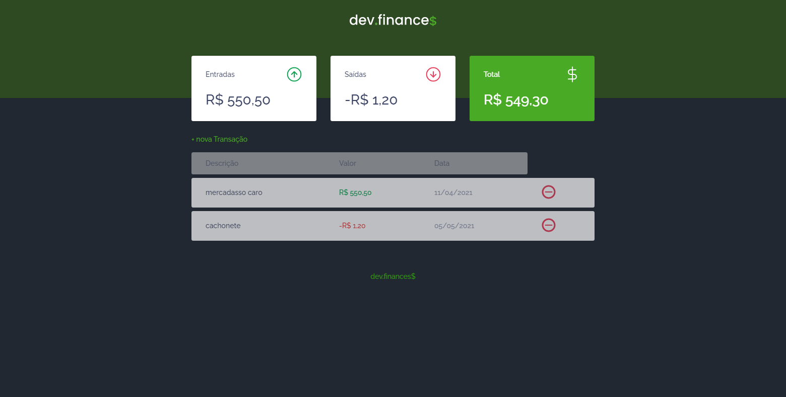
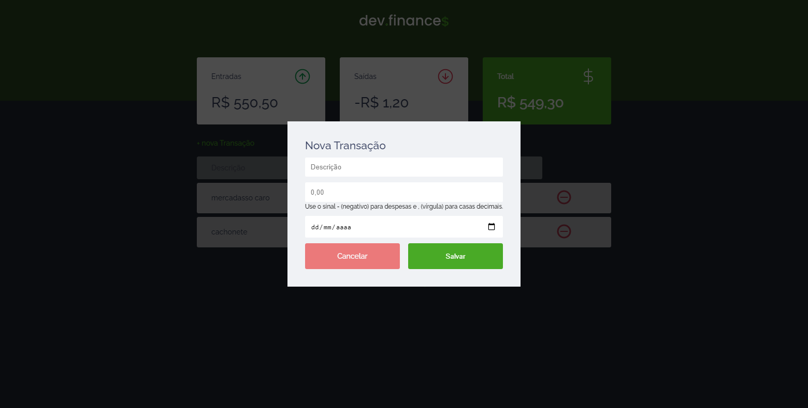

# Maratona-discover
Projeto desenvolvido durante a Maratona-discover, evento organizado pela [Rocketseat](https://maratonadiscover.rocketseat.com.br/inscricao) ,cujo este consiste em um sistema web de finanças .

# Sobre 🧐

com este sistema o usuário consegue calcular suas despesas , e ganhos . conseguindo saber também se está endividado e a quantia necessária para quitar a mesma.
. cada conta adicionada é armazenada no Local Storage do browser do usúario.

# Deploy
[projeto no netlify](https://heuristic-goodall-d2cfe9.netlify.app/)

